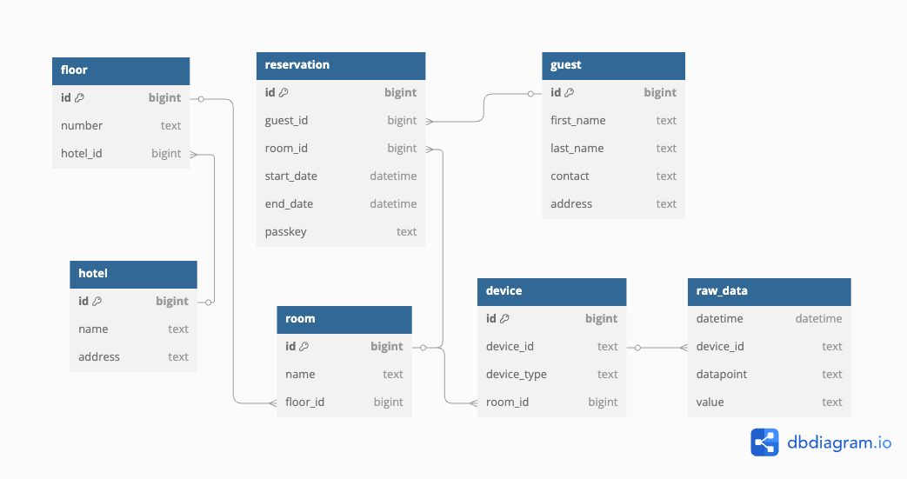

# Smart Hotel System

A web app for hotel guest to interact with IOT device installed in their room.

## Prerequisites

Before starting, make sure you have the following installed:

- Docker & Docker Compose
- Node.js (v20+)
- Yarn
- Python 3.11+
- PostgreSQL client (optional, for debugging)

---

## Database Setup (PostgreSQL + TimescaleDB + RabbitMQ)

### Prerequisites

- Docker & Docker Compose

### Steps

Go to the database directory

`cd db`

Copy the example environment config

`cp .env.example .env`

Update the values inside `.env` as needed
```
PG_USER=altoadmin
PG_PASSWORD=altopassword
PG_DB=smarthotel_db
PG_PORT=10202

RABBITMQ_USER=guest
RABBITMQ_PASS=guest
RABBITMQ_BROKER_PORT=10203
RABBITMQ_UI_PORT=10204

PGADMIN_EMAIL=admin@alto.com
PGADMIN_PASSWORD=admin123
PGADMIN_PORT=10206
```

Create the shared Docker network (if not already)

`docker network create smarthotel_network`

Start the database services

`make start`

## Supabase Setup

To setup a realtime_data table in your supabase clould project, simply run the following SQL in SQL Editor:
```
create table public.realtime_data (
  id uuid not null default gen_random_uuid (),
  device_id bigint not null,
  datapoint text not null,
  value text null,
  updated_at timestamp with time zone null default now(),
  constraint realtime_data_pkey primary key (id),
  constraint realtime_data_device_id_datapoint_key unique (device_id, datapoint)
) TABLESPACE pg_default;

create trigger set_updated_at BEFORE
update on realtime_data for EACH row
execute FUNCTION update_timestamp ();
```

Enable RLS to allow real time data fetching whenever an update occurs in the table and create a policy to allow SELECT for users.

Example Policy:
```
alter policy "Allow all"
on "public"."realtime_data"
to public
using (
  true
);
```

Setup a API KEY for your project and copy the project URL for backend setup below.

## Backend Setup for Python Django Server

### Prerequisites

- Python 3.11+

### Steps

Go to the backend directory

`cd backend`

Copy the example environment config

`cp .env.example .env`

Update the values inside `.env` as needed
```
DJANGO_SETTINGS_MODULE=config.settings

APP_URL=http://localhost:10206

PG_DB_HOST=smartHotel_db
PG_DB_PORT=5432
PG_DB_NAME=smarthotel_db
PG_DB_USER=altoadmin
PG_DB_PASS=altopassword

RABBITMQ_HOST=smartHotel_rabbitmq
RABBITMQ_PORT=5672

SUPABASE_URL=
SUPABASE_KEY=

OPENAI_KEY=

PGADMIN_PORT=10206
```

Install the packages

`pip3 install -r requirements.txt`

Start the backend service

`make start`

The django server will be running at `http://localhost:10205`

### Running agents to record the realtime data from sensors and power meters

To mock the real time consumption of the data from sensors and power meters, please place the CSV files in the `agents/sample-data folder`. The name of the file should clearly reflect room id, as the name should be in following format for following devices:

- IAQ Sensor : iaq_data_D<device_id>.csv
- Presence Sensor : presence_sensor_data_R<device_id>.csv
- Power Meter : power_meter_data_R<room_id>.csv

All the id values are to be assigned from the relational database tables for Hotel, Floor, Room and Device respectively. 
Example:
For Room 101 (ID: 1) in Floor 1 (ID: 1) of Hotel Altotech (ID: 1), the appropriate csv file names would be:
- iaq_data_D1.csv (stored with id 1 in device table)
- presence_sensor_data_D2.csv (stored with id 2 in device table)
- power_meter_data_R1.csv

To start the agents to publish the data, simple run the command

`make agents-start`

## Frontend Setup for React App
### Prerequisites

- Node.js (v20+)
- Yarn

### Steps

Go to the frontend directory

`cd frontend`

Copy the example environment config

`cp .env.example .env`

Update the values inside `.env` as needed
```
VITE_BACKEND_URL=http://localhost:10205

VITE_SUPABASE_URL
VITE_SUPABASE_ANON_KEY=
```

Install the packages

`yarn install`

Start the app

`make start`

The django server will be running at `http://localhost:10206`

## Entity Relationship Diagram

Here is the simplified entity relationship diagram for the relational database.


